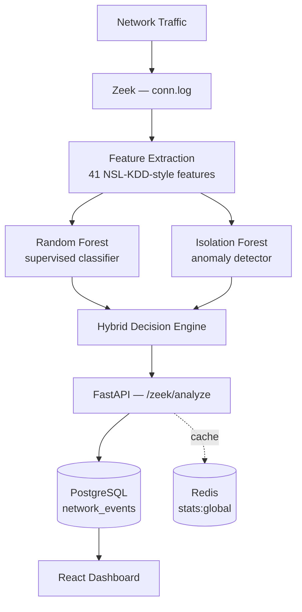

# 🛡️ Intelligent Intrusion Detection System (IDS)

**Système Intelligent de Détection d'Intrusions Réseau**

An end-to-end network Intrusion Detection System that combines **Zeek** network traffic analysis with a **hybrid Machine Learning engine** (Random Forest + Isolation Forest), exposed through a **FastAPI** backend and visualized in a **React** security dashboard.

> Master's Final Year Project — Réseaux et Systèmes Informatiques, FST Settat, Université Hassan I.

---

## 📌 Table of Contents

- [Overview](#-overview)
- [Architecture](#-architecture)
- [How It Works](#-how-it-works)
- [Machine Learning Engine](#-machine-learning-engine)
- [Tech Stack](#-tech-stack)
- [Project Structure](#-project-structure)
- [API Endpoints](#-api-endpoints)
- [Database Schema](#-database-schema)
- [Results](#-results)
- [Getting Started](#-getting-started)
- [Limitations](#-limitations)
- [Roadmap](#-roadmap)
- [License](#-license)

---

## 🔍 Overview

Modern networks generate huge volumes of traffic, and attacks are increasingly hard to catch with static rule-based systems alone. This project builds a **prototype IDS** that:

1. Captures/analyzes network traffic with **Zeek**
2. Extracts NSL-KDD-compatible features from Zeek's `conn.log`
3. Runs two complementary ML models — a **supervised classifier** and an **anomaly detector**
4. Combines both into a single hybrid decision: `NORMAL`, `SUSPICIOUS`, or `ATTACK`
5. Persists every event and its scores in **PostgreSQL**
6. Serves everything through a **FastAPI** REST API
7. Displays live flows, alerts, and statistics on a **React** dashboard

---

## 🏗️ Architecture



**Data flow:**

```
Traffic → Zeek → Feature Extraction → ML (RF + IF) → FastAPI → PostgreSQL → Dashboard
```

Each stage has a single responsibility: Zeek turns packets into structured connection logs, the feature extractor turns those logs into a model-ready vector, the ML engine turns the vector into a decision, and FastAPI turns the decision into a persisted, queryable event.

---

## ⚙️ How It Works

1. **Traffic capture** — Zeek monitors the network and writes structured connection records to `conn.log` (source/destination IP & port, protocol, duration, bytes, packets, connection state, etc.).
2. **Parsing** — `zeek_conn_parser.py` reads `conn.log` and normalizes Zeek's field names into a clean dictionary.
3. **Feature extraction** — `zeek_feature_extractor.py` converts the normalized record into the **41 features** the models were trained on, in the **exact order** used during training (validated against `models/ids_config.joblib`).
4. **Inference** — `zeek_ids_inference.py` loads both models and runs:
   - Random Forest → probability of attack `P_RF(attack)`
   - Isolation Forest → anomaly score `S_IF(x)`
5. **Hybrid decision** — the two outputs are combined (see formula below) into one of three verdicts.
6. **API ingestion** — the result is POSTed to `/zeek/analyze`, which stores the event (with its scores) in PostgreSQL and raises an alert if the decision is `ATTACK` or `SUSPICIOUS`.
7. **Visualization** — the React dashboard polls `/statistics`, `/statistics/timeline`, and `/zeek/events` to show live counts, a detection timeline, an attack relationship map (D3.js), and a detailed event table.

---

## 🧠 Machine Learning Engine

### Random Forest (supervised classifier)
Answers: *"Does this connection look enough like an attack?"* Trained on the **NSL-KDD** dataset (125,973 training / 22,544 test connections, 41 features → 122 after categorical encoding).

### Isolation Forest (anomaly detector)
Answers: *"Is this connection statistically unusual?"* — independent of any labeled attack class, so it can catch novel/unseen behavior.

### Hybrid decision logic

$$
Decision(x)=
\begin{cases}
ATTACK & \text{if } P_{RF}(attack) \geq 0.40 \\
SUSPICIOUS & \text{if } P_{RF}(attack) < 0.40 \ \text{and} \ S_{IF}(x) \leq -0.10 \\
NORMAL & \text{otherwise}
\end{cases}
$$

```python
rf_probability = random_forest.predict_proba(X)[0][1]
rf_prediction  = rf_probability >= RF_THRESHOLD      # 0.40

if_score    = isolation_forest.decision_function(X)[0]
if_anomaly  = if_score <= IF_THRESHOLD                # -0.10

if rf_prediction:
    decision = "ATTACK"
elif if_anomaly:
    decision = "SUSPICIOUS"
else:
    decision = "NORMAL"
```

Keeping both scores (not just the final label) makes false positives/negatives explainable and the thresholds tunable per deployment context (e.g. a SOC may prefer fewer false negatives over fewer alerts).

---

## 🧰 Tech Stack

| Layer | Technology | Role |
|---|---|---|
| Traffic analysis | **Zeek** | Converts raw traffic into structured connection logs |
| Data | **NSL-KDD** | Initial training/evaluation dataset |
| ML | **Scikit-learn** | Model implementation |
| ML — classification | **Random Forest** | Supervised attack classification |
| ML — anomaly detection | **Isolation Forest** | Unsupervised anomaly scoring |
| Backend | **FastAPI** | REST API, validation, orchestration |
| Database | **PostgreSQL** | Persists network events & ML scores |
| Cache | **Redis** | Caches global statistics (10s TTL) |
| Frontend | **React** | Security monitoring dashboard |
| Visualization | **D3.js** | Attack relationship map |
| Build tool | **Vite** | Frontend bundling |
| Infra | **Docker** | Service orchestration |

---

## 📁 Project Structure

```
ids-intelligent/
├── backend/        # FastAPI app, SQLAlchemy models, services, routes
├── frontend/        # React dashboard
├── ml/               # Data prep, training, validation, inference scripts
│   └── inference/
│       ├── zeek_conn_parser.py
│       ├── zeek_feature_extractor.py
│       └── zeek_ids_inference.py
├── models/          # Saved ML models + ids_config.joblib
├── data/
│   ├── raw/          # NSL-KDD raw data
│   ├── processed/    # Transformed data
│   └── analysis/     # Zeek prediction outputs
├── capture/zeek/     # Network captures & Zeek outputs
└── infra/            # Infrastructure configuration
```

---

## 🔌 API Endpoints

| Method | Endpoint | Description |
|---|---|---|
| `POST` | `/zeek/analyze` | Submit connection features → get decision, persist event |
| `GET` | `/zeek/events` | List events, filterable by decision, source IP, time range, page |
| `GET` | `/statistics` | Global counts: total flows, attacks, normal, suspicious, attack rate |
| `GET` | `/statistics/timeline` | Time series of detections for the dashboard chart |

Full interactive docs are auto-generated by FastAPI at `/docs` (OpenAPI/Swagger).

---

## 🗄️ Database Schema — `network_events`

| Field | Description |
|---|---|
| `id`, `uid` | Event ID / Zeek connection UID |
| `source_ip`, `source_port` | Origin of the connection |
| `destination_ip`, `destination_port` | Target of the connection |
| `protocol`, `service`, `connection_state` | Connection metadata |
| `duration`, `source_bytes`, `destination_bytes` | Traffic volume |
| `source_packets`, `destination_packets` | Packet counts |
| `decision` | `NORMAL` / `SUSPICIOUS` / `ATTACK` |
| `rf_probability`, `rf_prediction` | Random Forest output |
| `if_score`, `if_anomaly` | Isolation Forest output |
| `created_at` | Timestamp |

---

## 📊 Results

| Model | Accuracy | Note |
|---|---|---|
| Logistic Regression (baseline) | 0.7537 | Reference model |
| **Random Forest (final)** | **0.7758** | Precision ≈ 0.97, Recall ≈ 0.63 on attack class @ threshold 0.40 |

| RF Threshold | Precision | Recall | F1 |
|---|---|---|---|
| 0.40 | 0.9693 | 0.6726 | 0.7942 |
| 0.20 | 0.9549 | 0.7675 | 0.8510 |
| 0.10 | 0.9204 | 0.8459 | 0.8816 |

**End-to-end validation:** all pipeline stages (model loading, feature order, Zeek parsing/inference, API routes, PostgreSQL persistence, React build) were verified functional — see the [full technical report](#) for details.

---

## 🚀 Getting Started

```bash
# Backend
cd ids-intelligent
source .venv/bin/activate
uvicorn backend.app.main:app --reload

# Frontend
cd ids-intelligent/frontend
npm run dev

# Run Zeek inference on a conn.log
python ml/inference/zeek_ids_inference.py

# Verify PostgreSQL events
docker exec -it ids-intelligent-postgres-1 \
  psql -U ids_user -d ids_db \
  -c "SELECT id, uid, source_ip, destination_ip, decision, rf_probability, if_score, created_at
      FROM network_events ORDER BY created_at DESC LIMIT 10;"
```

---

## ⚠️ Limitations

- Trained/evaluated on **NSL-KDD**, which doesn't fully represent modern real-world traffic.
- Mapping Zeek's live features to NSL-KDD's historical feature set is a nontrivial engineering constraint.
- No large-scale benchmark on real annotated traffic yet — current tests validate the pipeline, not statistical performance at scale.
- Isolation Forest hasn't been benchmarked with the same rigor as Random Forest.
- Decision thresholds (`RF = 0.40`, `IF = -0.10`) are operational parameters, not fixed constants — they should be re-tuned per deployment.

---

## 🗺️ Roadmap

- [ ] Train/evaluate on modern datasets (CICIDS2017, UNSW-NB15)
- [ ] Enrich features with Zeek's HTTP, DNS, TLS, and file-transfer logs
- [ ] Add a temporal dimension (sequence models: LSTM / Transformer)
- [ ] Add explainability (SHAP) to justify each alert
- [ ] "SOC Copilot" assistant to summarize and triage detected events

---

## 👤 Author

**MOUHIB Ayoub** — Master's in Réseaux et Systèmes Informatiques, FST Settat
Supervised by **Pr. A. Marzouk**

## 📄 License

